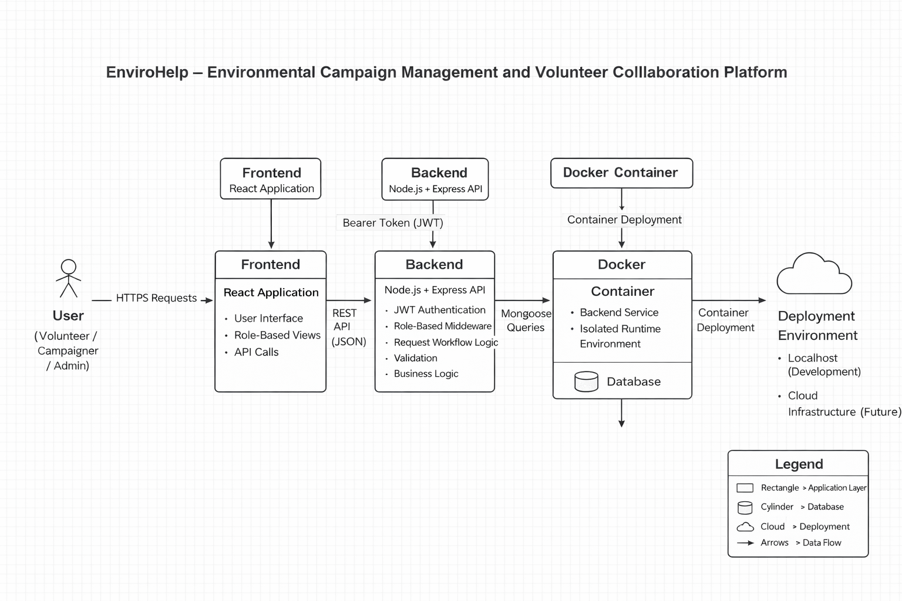

# EnviroHelp – Environmental Campaign Management and Volunteer Collaboration Platform

## Project Overview

EnviroHelp is a full-stack web application designed to connect environmental campaigners with volunteers through a structured and secure digital platform. The system enables campaign creation, volunteer participation requests, assignment management, and campaign progress tracking.

The platform is implemented using Node.js and Express for the backend, MongoDB with Mongoose for data modeling, JWT for authentication, bcrypt for password hashing, and Docker for containerization. The system follows a role-based access control model to ensure secure and structured interactions between users.

---

## Problem Statement

Environmental initiatives often face challenges such as decentralized coordination, inefficient volunteer management, lack of structured approval workflows, and limited visibility into campaign progress. Manual processes reduce transparency and scalability.

There is a need for a centralized platform that enables campaign organizers to manage initiatives efficiently while allowing volunteers to participate through a secure and accountable workflow. EnviroHelp addresses this problem by providing structured collaboration, request handling, and progress monitoring within a secure system architecture.

---

## Target Users (Personas)

### Volunteer
A user who searches for environmental campaigns, submits participation requests, accepts assignments, updates progress, and completes campaigns.

### Campaigner
A user who creates and manages campaigns, reviews volunteer requests, assigns volunteers, and tracks campaign progress.

### Admin
A supervisory user who monitors campaigns, oversees requests, and reviews flagged activity within the system.

---

## Vision Statement

To develop a scalable and secure digital platform that enhances environmental collaboration by streamlining campaign coordination, ensuring transparency, and enabling structured volunteer engagement.

---

Assumptions

Users have access to internet and a modern web browser.

Campaigners provide accurate and truthful campaign information.

Volunteers update campaign progress honestly.

MongoDB database service remains available and reliable.

JWT authentication tokens are securely stored and transmitted.

---

Constraints

Limited development timeline due to academic project scope.

No mobile application support in this version.

No payment or financial transaction integration.

No real-time messaging system between users.

Deployment is limited to local or basic cloud environments.

---

## System Architecture Overview

The system follows a layered architecture:

Frontend (React – planned integration)  
Backend (Node.js and Express REST API)  
Authentication Layer (JWT and bcrypt)  
Database Layer (MongoDB with Mongoose ODM)  
Containerization (Docker)  
Deployment Environment (Localhost or Cloud infrastructure)

The backend exposes RESTful endpoints protected by middleware. Authentication is handled using JWT tokens, and authorization is enforced through role-based middleware checks. MongoDB schemas define structured collections for campaigns, users, and requests.

## Architecture Diagram

---

## Authentication and Security Design

EnviroHelp implements secure authentication and authorization mechanisms:

- Password hashing using bcrypt  
- JWT-based session management  
- Role-based access control  
- Route-level middleware protection  
- Input validation and status-based restrictions  

Only authenticated users with appropriate roles can access protected endpoints. Sensitive operations such as campaign assignment and request approval are strictly controlled through middleware validation.

---

## Database Design

The application uses MongoDB with Mongoose for schema-based data modeling.

### Campaign
- campaigner_id (ObjectId reference)  
- name  
- description  
- start_date  
- end_date  
- goal  
- assigned_to  
- completion_percent  
- is_flagged  
- contact  
- created_date  

### Volunteer
- name  
- campaigns_completed  
- profile_pic  
- contact  
- email  
- is_flagged  

### Campaigner
- name  
- profile_pic  
- contact  
- email  
- is_flagged  

### Request
- campaign_id  
- volunteer_id  
- requirements  
- assigned  
- campaigner_updated  
- volunteer_updated  

### Login
- username  
- hash  
- role  
- id (linked to Campaigner or Volunteer)  

Virtual relationships are implemented using Mongoose population to simulate relational references between collections.

---

## Core Functional Features

- User registration for volunteers and campaigners  
- Secure login with JWT session tokens  
- Campaign creation, update, and deletion  
- Volunteer search functionality  
- Volunteer request submission  
- Request negotiation and approval workflow  
- Volunteer assignment management  
- Campaign progress tracking  
- Campaign completion updates  
- Administrative monitoring  

---

## Success Metrics

- Number of successfully completed campaigns  
- Volunteer engagement rate  
- Campaign completion percentage  
- Active user participation  
- System availability and reliability  

---

## Quick Start – Local Development

### Prerequisites
- Node.js  
- Docker Desktop  
- MongoDB instance (local or cloud)  

### Running with Docker

1. Navigate to backend directory  
   cd backend  

2. Build Docker image  
   docker build -t envirohelp .  

3. Run Docker container  
   docker run -p 3000:3000 envirohelp  

4. Open in browser  
   http://localhost:3000  

---

## Branching Strategy

This project follows GitHub Flow:

- The main branch contains stable code.  
- Feature branches are created for new functionality.  
- Pull requests are used before merging changes into main.  

This approach ensures structured version control and maintainable development.

---

## Development Tools

- Node.js  
- Express.js  
- MongoDB  
- Mongoose  
- JWT  
- bcrypt  
- Docker  
- GitHub  
- Visual Studio Code  

---

## Repository Structure

envirohelp/  
│  
├── backend/  
│   ├── app.js  
│   ├── middleware.js  
│   ├── orm.js  
│   ├── Dockerfile  
│  
├── docs/  
│   └── screenshots/  
│  
├── README.md  
└── .gitignore  

---

## MoSCoW Prioritization

### Must Have

These features are essential for the system to function.

- User registration and login (JWT-based authentication)
- Role-based access control (Volunteer, Campaigner)
- Campaign creation and management
- Volunteer campaign request submission
- Accept / Reject request workflow
- Campaign assignment logic
- Campaign progress tracking (completion percentage)
- MongoDB database integration
- Dockerized backend for local development

### Should Have

These features improve usability but are not critical for basic system operation.

- Search campaigns functionality
- Search volunteers functionality
- Volunteer profile viewing
- Campaign editing and deletion
- Request negotiation updates
- Display of active vs unassigned campaigns
- Basic validation for form inputs

### Could Have

These features enhance user experience but are optional for the first release.

- Notification system for request updates
- Email verification during registration
- Dashboard analytics (campaign statistics)
- Profile picture uploads
- Rating or feedback system for volunteers

### Won’t Have (For This Version)

These features are intentionally excluded from the current scope.

- Mobile application
- Payment integration
- AI-based campaign recommendations
- Real-time messaging between users
- Advanced analytics engine

